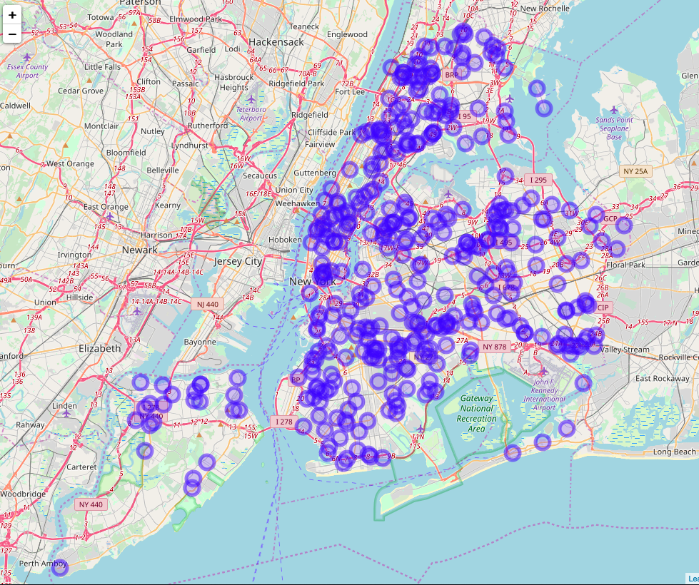

#Introduction

## Problem Statement:
Motor vehicle collisions are tied to our daily lives closely. If you ever subscribed to the City of New York's official source for information – Notify NYC, you might receive emails or text messages notifying you the vehicle collisions just happened with a brief description including the location, time, and so on.

Besides the notification sent from the City office, NYPD collects the historical motor vehicle collision data and posts it on the NYPD website for public access. According to NYC OpenData – the City's official data portal,  this collision data is "manually run every month and reviewed by the TrafficStat Unit before being posted on the NYPD website." Each record/row/observation represents a collision in NYC, indicating some important attribute, such as date, time, location, and the number of people involved.

By visualizing the collision data collected by NYPD, we can better understand the trends of collisions occurred in the past years and find out their patterns, and therefore, provide insights to government agencies and public to take actions to diminish suck kinds of accidents and the corresponding damage and improve public safety.

## Goals:
Our main goal is to interpret the following three parts through data visualization:
1. Trend of Collisions
2. Neighborhoods that mostly collisions happen
3. Top contributing factors that caused the collisions

## Dataset:
Dataset Name: NYPD Motor Vehicle Collisions

Source: NYC Open Data https://data.cityofnewyork.us/Public-Safety/NYPD-Motor-Vehicle-Collisions/h9gi-nx95

Dimension (by the time that our dataset was exported):
- Observations: 1,471,119
- Variables: 30

Time Period: 2012-10-21 to 2019-04-01


# Data Preprocessing

First, we installed necessary packages and loaded corresponding libraries to setup the working environment.
```{r setup, include=FALSE}

## Set working directory:
setwd <- function(dir) {
  if (missing(dir) || is.null(dir) || dir == "") {
    dir <- "~/Desktop"
  }
  base::setwd(dir)
}

install.packages("tidyverse", repos="http://cran.rstudio.com/")
## Core tidyverse packages automatically load ggplot2, dplyr, tidyr, readr, purrr, tibble, stringr, forcats.
library(tidyverse)

## The lubridate package comes with tidyverse but the library needs to be load separately.
library(lubridate)

## Intall the package to read large local CSV file through fread() function:
install.packages("data.table", repos="http://cran.rstudio.com/")
library(data.table)


## Install the package to geocode locations between longitude & latitiude <> zip code & neighborhood,
## and visualize spatial data and models on top of static maps from various online sources (e.g Google Maps and Stamen Maps).
install.packages("ggmap", repos="http://cran.rstudio.com/")
library(ggmap)

## Turn off scientific notation
options(scipen = 999)

## Graphical scales map data to aesthetics, and provide methods for automatically
## determining breaks and labels for axes and legends for visulization.
install.packages("scales", repos="http://cran.rstudio.com/")
library(scales)

```

Then, we extract the data from the identified data source(s).

### Data Import Method 1: Socrata Open Data API (SODA)
  * Please uncomment the all code in the chuck below to run as it takes about 10 minute to fectch data from OpenData API.
```{r data-import-SODA, echo=FALSE}

# ## ------ Data Import ------
# 
# ## Install the required package of NYC Open Data SODA API to access the data online:
# install.packages("RSocrata", repos="http://cran.rstudio.com/")
# library(RSocrata)
# 
# ## Data Import Method 1: Access data via NYC Open Data SODA API:
# # nyc_collision <- read.socrata("https://data.cityofnewyork.us/resource/qiz3-axqb.json", 
# #                               app_token = "2vFix7G27Pze1rkNxoSIVY2TJ")
# 
# 
# View(nyc_collision)
# dim(nyc_collision)
# glimpse(nyc_collision)

```

- Data Import Method 2: Read raw data from CSV file
  * Please uncomment the all code in the chuck below if you want to try the script.
```{r data-import-csv, echo=FALSE}

# ## Data Import Method 2: Read raw data from CSV file:
# getwd()
# nyc_collision_raw <- fread("./NYPD_Motor_Vehicle_Collisions.csv")
# glimpse(nyc_collision_raw)

```

#### Note 1: 
The data fetched from NYC Open Data SODA API has one extra column "location.type" than what listed on the website or CSV file.

#### Note 2:
The field/column name in CSV file and from SODA API are formated differently. The cleaning process is using the data extracted from SODA API, not from CSV file.


# Cleaning Process:
1. Drop columns that have > 15% of missing values -- 18 of 30 variables are kept
2. Keep only rows which have both valid latitude and longitude values
3. Convert the data type of columns `latitude`, `longitude`, `number_of_cyclist_injured`:`number_of_persons_killed` from character to numeric values by column index using modify_at()
4. Keep only rows which have both valid `contributing_factor_vehicle_1` and `vehicle_type_code1`
5. Replacing missing value with "None" in column `contributing_factor_vehicle_2`
6. Replacing missing value with 0 in columns `number_of_persons_injured` and `number_of_persons_killed`

   * Please uncomment the all code in the chuck below if you want to try the script.
```{r data-cleaning, include=FALSE}

# nyc_collision <- as_tibble(nyc_collision)
# str(nyc_collision)
# nyc_collision
# 
# ## Overview the total number of NA in each column:
# map(nyc_collision, ~sum(is.na(.)))   ## Display the total number of NA of each variable by 1 object per row.
# 
# colSums(is.na(nyc_collision))   ## Display the total number of NA of each variable by by showing multiple object per row.
# 
# ## Get the percentage of NA (missing value in each colum):
# filter_vars <- nyc_collision %>% 
#   map_dbl(~sum(is.na(.)) / length(.))
# filter_vars %>% str()
# str(filter_vars)
# 
# 
# nyc_collision %>%
#   filter(is.na(longitude)) %>%
#   View()
# 
# ## Display the columns that have Miss Value rate less or equal than 15%, which should be keep for analysis:
# filter_vars <- nyc_collision %>%
#   map_dbl(~sum(is.na(.))/length(.))
# filter_vars[filter_vars > 0.15]
# 
# str(nyc_collision)
# 
# ## Display columns which contain over 15% missing values:
# filter_vars[filter_vars > 0.15]
# 
# 
# 
# ## Save columns which contain less or equal 15% missing values:
# nyc_collision_saved <- nyc_collision %>% 
#   select(names(filter_vars[filter_vars <= 0.15]))
# # nyc_collision[names(filter_vars[filter_vars <= 0.15])]
# 
# str(nyc_collision_saved)
# glimpse(nyc_collision_saved)
# 
# ## Keep only rows which have both valid latitude and longitude values:
# nyc_collision_saved <- subset(nyc_collision_saved, !(is.na(`latitude`)) & !(is.na(`longitude`)))
# 
# ## Convert columns `latitude`, `longitude`, `number_of_cyclist_injured`:`number_of_persons_killed` from character to numeric values by column index:
# nyc_collision_saved <- nyc_collision_saved %>%
#   modify_at(c(4, 7:15), ~as.numeric(.))
# 
# glimpse(nyc_collision_saved)
# 
# 
# str(nyc_collision_saved)
# glimpse(nyc_collision_saved)
# 
# View(nyc_collision_saved)
# 
# 
# colSums(is.na(nyc_collision_saved))
# 
# nyc_collision_saved %>%
#   filter(is.na(`contributing_factor_vehicle_1`)) %>%
#   View()
# 
# ## Keep only rows which have both valid `contributing_factor_vehicle_1` and `vehicle_type_code1`:
# nyc_collision_saved <- subset(nyc_collision_saved, !(is.na(`contributing_factor_vehicle_1`)) & !(is.na(`vehicle_type_code1`)))
# 
# View(nyc_collision_saved)
# 
# colSums(is.na(nyc_collision_saved))
# 
# ## Replacing missing value with "None" in column `contributing_factor_vehicle_2`:
# nyc_collision_saved[, 2][is.na(nyc_collision_saved[, 2])] <- c("None")
# colSums(is.na(nyc_collision_saved))
# 
# ## Replacing missing value with 0 in columns `number_of_persons_injured` and `number_of_persons_killed`:
# nyc_collision_saved[, 14:15][is.na(nyc_collision_saved[, 14:15])] <- 0
# colSums(is.na(nyc_collision_saved))

```

7. Save the final cleaned dataset as .Rda file for next steps
*** Please uncomment the all code in the chuck below if you want to try the script.
```{r save-data, include=FALSE}

# ##Save the final cleaned data as Rda file for future use:
# getwd()
# # setwd("./data")
# # getwd()
# save(nyc_collision_saved, file = "nyc_collision_saved.Rda")

```

### Limits:
- Unidentified value / misspelling / case-sensitive affects statistics
- Imbalanced data: E.g., 75 percentile of collisions had zero people injured. This will affect the prediction accuracy while using `number_of_persons_killed` as a feature for modeling


# Data Visualization

## Visualization: Part 1
### NYC Collisions on New Year’s Day 2019

Plot Type: Interactive Map

Dataset: 
Collisions occurred on New Year’s Day 2019 are filtered

R Packages used:
leaflet

Variables:
longitude, latitude

```{r nyd19-collision-map, include=FALSE}

load("../data/nyc_collision_saved.Rda")

## ------ Interactive Maps with Leaflet ------
## Install the open-source JavaScript libraries leaflet for interactive maps:
install.packages("leaflet", repos="http://cran.rstudio.com/")
library(leaflet)

collisons_2019_newyear <- nyc_collision_saved %>% 
  filter(date == "2019-01-01")

collisons_2019_newyear

collision_map <- leaflet(collisons_2019_newyear) %>% 
  addTiles() %>% 
  addCircleMarkers(lng = ~longitude, lat = ~latitude, popup = "NYC Collisions")

collision_map


glimpse(nyc_collision_saved)

```


### Results:
- Total 381 collisions occurred on 2019-01-01
- Mostly happened in Soho, Midtown (34th St – 60th St), and Sunnyside

### Limits:
- Large dataset overload: even monthly data are difficult to be rendered. Over 15K collisions happened in just January 2019.

```{r rm-raw, include=FALSE}

rm(nyc_collision_saved, collisons_2019_newyear, collision_map)
gc()

```


