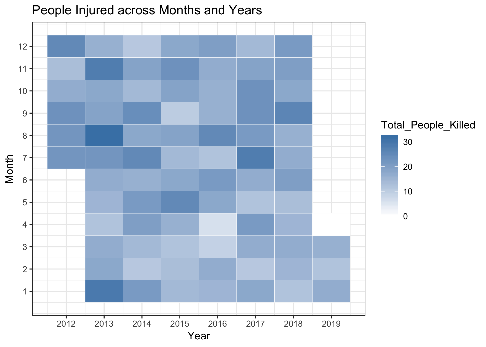
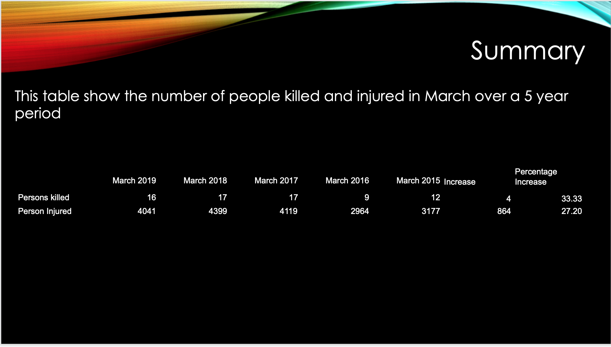

### Visualization: Part 2

```{R, include=FALSE}

# Installing the required libraries
install.packages("ggplot2", repos = "http://cran.us.r-project.org")
install.packages("hms", repos = "http://cran.us.r-project.org")
install.packages('reshape2', repos = "http://cran.us.r-project.org")

# Loading the libraries
library(ggplot2)
library(lubridate)
library(reshape2)


# Set Working Directory
setwd <- function(dir) {
  if (missing(dir) || is.null(dir) || dir == "") {
    dir <- "C:/Users/me/Desktop"
  }
  base::setwd(dir)
}

load("../data/nyc_collision_saved.Rda")

# Storing the indexes of necessary columns
colnum <- c("date", "latitude", "longitude", "number_of_cyclist_injured", "number_of_cyclist_killed", "number_of_motorist_injured", "number_of_motorist_killed", "number_of_pedestrians_injured", "number_of_pedestrians_killed", "number_of_persons_injured", "number_of_persons_killed", "time", "vehicle_type_code1")

# Creating a dataframe with only required columns
df <- nyc_collision_saved[,colnum]
df$time <- hm(df$time)
df$Hour_Interval <- hour(df$time)
df$Year <- year(df$date)
df$Month <- month(df$date)
```

```{R plot3, include=FALSE}
# PLOT 3 - KILLING STATISTICS THROUGHOUT THE DAY
df1 <- aggregate.data.frame(x = df$number_of_persons_killed , by = list(Hour_of_day=df$Hour_Interval), FUN = sum)
names(df1)[2] <- "Total_People_Killed"

plot3 <- ggplot(df1, aes(x = Hour_of_day, y = Total_People_Killed)) +
  geom_bar(stat = "identity", show.legend = TRUE, fill="Red") +
  geom_smooth(method = "auto", col="blue", se=FALSE) +
  scale_colour_brewer(palette = "Set1") +
  ggtitle("Accident Killings across time of the day") +
  theme_bw()
#save image 3
ggsave(filename="Plot3.png", plot=plot3)
```

```{R plot5, include=FALSE}


# PLOT 5 - INJURED vs KILLING STACKED BAR CHART ACROSS YEARS
df2 <- aggregate.data.frame(x = df$number_of_persons_killed , by = list(Year=df$Year), FUN = sum)
names(df2)[2] <- "Total_People_Killed"

df3 <- aggregate.data.frame(x = df$number_of_persons_injured , by = list(Year=df$Year), FUN = sum)
names(df3)[2] <- "Total_People_Injured"
df4 <- as.data.frame(cbind(df2$Year,df2$Total_People_Killed,df3$Total_People_Injured))
names(df4) <- c("Year", "Total_People_Killed", "Total_People_Injured")
df5 <- melt(data = df4, id.vars = "Year")

plot5 <- ggplot(df5, aes(x = Year, y = value, fill=variable)) +
  geom_bar(stat = "identity") +
  ggtitle("People Injured vs Killed across Years") +
  theme_bw()
#save image 5
ggsave(filename="Plot5.png", plot=plot5) 
```

```{R plot6, include=FALSE}

# PLOT 6 HEATMAP FOR PEOPLE KILLED ACROSS MONTHS AND YEARS
df6 <- aggregate.data.frame(x = df$number_of_persons_killed , by = list(Month=df$Month,Year=df$Year), FUN = sum)
names(df6)[3] <- "Total_People_Killed"

plot6 <- ggplot(df6, aes(Year, Month)) +
  geom_tile(aes(fill = Total_People_Killed), colour = "white") +
  scale_fill_gradient(low = "white", high = "steelblue") +
  scale_y_continuous(breaks=seq(1, 12, 1)) +
  scale_x_continuous(breaks=seq(2012, 2019, 1)) +
  ggtitle("People Injured across Months and Years") +
  theme_bw()
#save image 6
ggsave(filename="Plot6.png", plot=plot6)
```
 
 
 


From what the graph is telling us, is that from 4am and 5pm is where the accident are occurring that are causing death. Why you may ask? Well it can be coming out from a party, working at night, trying to rush home (or to whereever the destination is.) Having the knowledge of the time to be more alerted. So at this time is where you would want to be very careful, wide awake, more alert than the usual. 
 
 
 
 
The next graph that will be analyzed is "People injured vs People killed across years".
The data is going to be presented in a Bar graph focusing on how many people were Injured and killed from the years 2012 to the year 2019.


From the graph, we can see that the year 2012 saw the lowest number of injured people with just under 25,000 people injured. While 2017 and 2018 were amongst the highest in people injured with over 55,000 people injured.
Some limitation was that it is hard to render on people killed per year because the data for people injured far exceeds that of people killed.

The next graph will focus on people killed across months and years.
The data is going to be represented in a Heat map that will focus on the number of people killed each month from the years 2012 to the year 2019.

# HEATMAP FOR PEOPLE KILLED ACROSS MONTHS AND YEARS



The heat map illustrates that in the first 4 months from the year 2012-2019 there was a lower number of people killed. However, from months 7-12 the heat map shows that there were more people killed per months. This is illustrated by the dark steel blue color which indicated a higher rate of killed during that particular month.
Some limitations are that the first 6 months of the data was not collected which could have had an impact on whether the first few months will still remain with fewer collisions than from months 7-12.


## Data Analysis

Once the data set have been clean we then took a closer look what we have. First we took the number of persons killed and number of perosn injuerd is not evenly spread out. This show that most of the accidents doesn't not have a person killed and or injured.

```{r Deaths, echo=FALSE}
#load the data set into the project 
load("../data/nyc_collision_saved.Rda")

hist(nyc_collision_saved$number_of_persons_killed)
```

```{r Injures, echo=FALSE}
hist(nyc_collision_saved$number_of_persons_injured)
```

When we started to break this finding down, it turns out that at least 75% of the accident doesn't result in and death or injure.

```{r Persons killed, echo=FALSE}
summary(nyc_collision_saved$number_of_persons_killed)
```

```{r Person injured, echo=FALSE}
summary(nyc_collision_saved$number_of_persons_injured)
```
The most person killed in a single accident took place on 10-31-2017, in the data the cause wasn't specify. 

The most person injured in a single accident took place on 09-09-2013, the cause of this accident wasn't specify but a passenger vehicle was involved.


```{r sub-sample, include=FALSE}
    # Get the manth of March from every year for 5 years 
    temp1<- nyc_collision_saved[nyc_collision_saved$date >= "2019-03-01" & nyc_collision_saved$date <= "2019-03-31",]
    temp2<- nyc_collision_saved[nyc_collision_saved$date >= "2018-03-01" & nyc_collision_saved$date <= "2018-03-31",]
    temp3<- nyc_collision_saved[nyc_collision_saved$date >= "2017-03-01" & nyc_collision_saved$date <= "2017-03-31",]
    temp4<- nyc_collision_saved[nyc_collision_saved$date >= "2016-03-01" & nyc_collision_saved$date <= "2016-03-31",]
    temp5<- nyc_collision_saved[nyc_collision_saved$date >= "2015-03-01" & nyc_collision_saved$date <= "2015-03-31",]
```   

```{r sumkilled, include=FALSE}
    # Get the number of persons killed from March of every year 
    sum(temp1$number_of_persons_killed)
    sum(temp2$number_of_persons_killed)
    sum(temp3$number_of_persons_killed)
    sum(temp4$number_of_persons_killed)
    sum(temp5$number_of_persons_killed)
```    

```{r suminjured,include=FALSE}
    #Get the number of person injured from March every year 
    sum(temp1$number_of_persons_injured)
    sum(temp2$number_of_persons_injured)
    sum(temp3$number_of_persons_injured)
    sum(temp4$number_of_persons_injured)
    sum(temp5$number_of_persons_injured)
    
```
After this I decided took a sub-sample of the data for the month of March over a 5 year period. Then took information from this an place them in a table where it is easies to view in a table. 




From the table was can see there was about a 27% increase in the number of injures between 2015 - 2019. but it's not a steady increase as in 2016 there was a drop in injures in that month. The same can be said about the number of persons killed in the same timeframe, a drop in 2016 and a 33% increase over all from 2015 - 2019. 

From the data collected and analysis we can conclued that about 47.6% of all the accidents a passenger vechicle was involved. This then when down the 27% of the sports utility vehicles. I was surprsing to find although they are taxis every where you go in New York City that only 4.4% of the accidents them, based on the data collected. Another surprising fact that .25% of the accident collected in the data invloved an Ambulance. 

Must of the accident record in data set the contributing factor wasn't specify, this was about 35.8%. So the highest known cuntributing factor for 18.2% of the accidents is Driver Inattention/Distraction. The second highest factor was failure to yield the right-of-way with 5.7%, that make since to me because in New York City everying is in a rust to get some where. The must surprize factor that I thought would be higher is alcohol, but only .94% of the accidents recorded in the data set. 